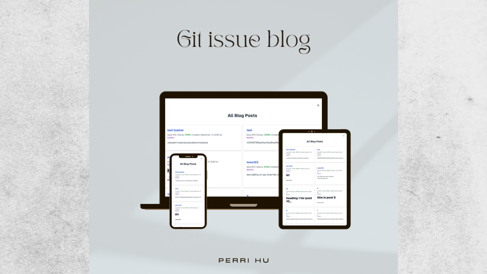

# Git issue blog

GitBlog is a modern blog application built without a traditional database. It leverages the GitHub GraphQL API to act as a complete Content Management System (CMS), showcasing how to use external services to build powerful and scalable applications.

## Table of contents

- [Links](#links)
- [My process](#my-process)
  - [Built with](#built-with)
- [Author](#author)

### Links

- Live Site URL: [here](https://issuetrackingboard.netlify.app/)

## My process

### Built with

- Next.js (App Router)
- NextAuth.js
- Tailwind CSS
- TypeScript
- GitHub GraphQL API
- Ant Design

## Author

- Twitter - [@NotPerry8811](https://www.twitter.com/NotPerry8811)
